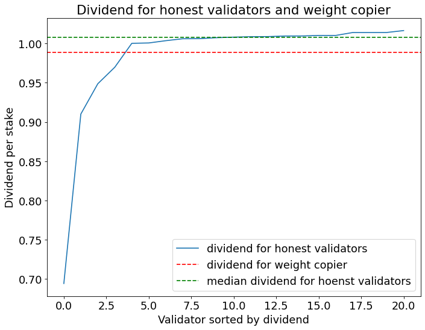
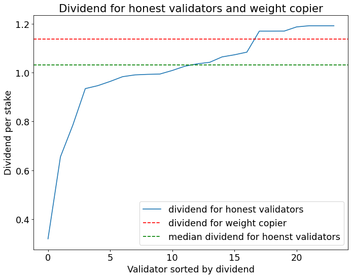
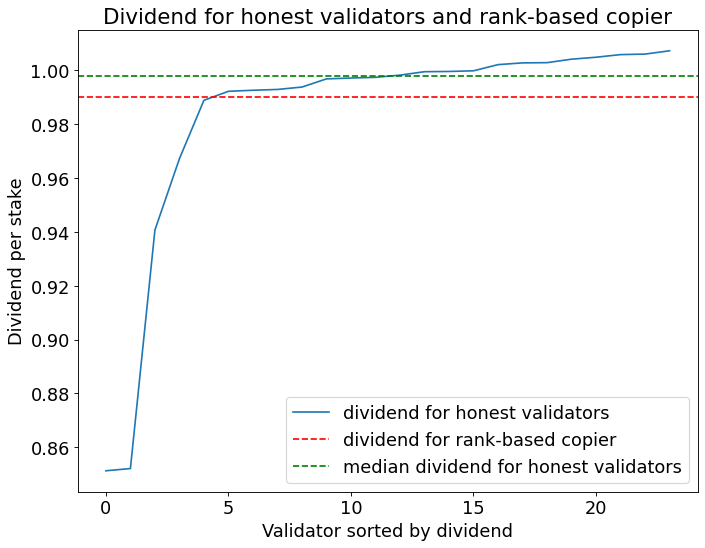
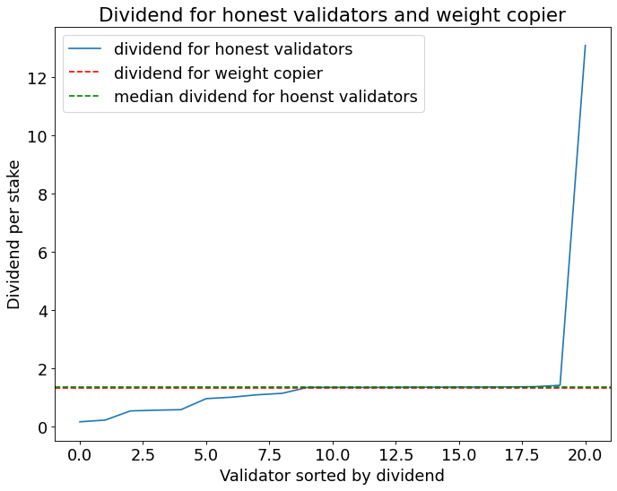

### Subnets Supporting Rank-Based Commitment Schemes (July 2024 Data)

The following subnets support rank-based commitment schemes, where validators earn higher dividends through childkeying compared to copying (either weight-based or rank-based), given optimal parameters for conceal periods and liquid alpha values:

1, 2, 7, 10, 11, 12, 14, 17, 19?, 20?, 22, 23, 27, 29?

### Optimal Parameters

#### Rank-Based Commitment Parameters

| Subnet | Conceal Period | Alpha_l | Alpha_h | Weight Copier           | Rank Copier             |
| ------ | -------------- | ------- | ------- | ----------------------- | ----------------------- |
| 1      | 5              | 0.1     | 0.3     |  |  |
| 2      | 13             | 0.1     | 0.7     |  |  |
| 3      | 9              | 0.3     | 0.3     |  |  |
| 4      | 7              | 0.1     | 0.9     |  |  |
| 5      | 9              | 0.1     | 0.9     |  |  |
| 7      | 9              | 0.3     | 0.9     |   |  |
| 8      | 15             | 0.3     | 0.3     |  |  |
| 10     | 15             | 0.1     | 0.9     |  |  |
| 11     | 5              | 0.3     | 0.3     |  |  |
| 12     | 9              | 0.3     | 0.3     |   |  |
| 14     | 15             | 0.1     | 0.1     |  |  |
| 15     | 3              | 0.9     | 0.9     |  |  |
| 17     | 15             | 0.1     | 0.5     |  |  |
| 18     | 15             | 0.1     | 0.3     |   |  |
| 19     | 13             | 0.1     | 0.1     |   |  |
| 20     | 7              | 0.1     | 0.1     |  |  |
| 22     | 1              | 0.1     | 0.3     |  |  |
| 23     | 15             | 0.1     | 0.9     |  |  |
| 25     | 15             | 0.1     | 0.9     |   |  |
| 26     | 11             | 0.1     | 0.9     |  |  |
| 27     | 3              | 0.1     | 0.9     |  |  |
| 28     | 1              | 0.1     | 0.9     |  |  |
| 29     | 7              | 0.1     | 0.9     |  |  |

#### Pure Commit-Reveal Parameters

| Subnet | Conceal Period | Alpha_l | Alpha_h | Weight Copier           | Rank Copier             |
| ------ | -------------- | ------- | ------- | ----------------------- | ----------------------- |
| 1      | 5              | 0.1     | 0.3     |  |  |
| 2      | 15             | 0.9     | 0.9     |  |  |
| 3      | 15             | 0.1     | 0.3     |  |  |
| 4      | 15             | 0.1     | 0.9     |  |  |
| 5      | 9              | 0.3     | 0.3     |  |  |
| 7      | 15             | 0.1     | 0.5     |   |  |
| 8      | 15             | 0.9     | 0.9     |  |  |
| 10     | 15             | 0.1     | 0.3     |  |  |
| 11     | 15             | 0.3     | 0.3     |   |  |
| 12     | 15             | 0.9     | 0.9     |  |  |
| 14     | 15             | 0.9     | 0.9     |  |  |
| 15     | 9              | 0.9     | 0.9     |  |  |
| 17     | 15             | 0.1     | 0.7     |  |  |
| 18     | 7              | 0.5     | 0.5     |  |  |
| 19     | 15             | 0.9     | 0.9     |   |  |
| 20     | 13             | 0.9     | 0.9     |  |  |
| 22     | 13             | 0.3     | 0.9     |  |  |
| 23     | 15             | 0.1     | 0.9     |  |  |
| 25     | 15             | 0.1     | 0.3     |  |  |
| 26     | 15             | 0.9     | 0.9     |   |  |
| 27     | 15             | 0.1     | 0.3     |  |  |
| 28     | 13             | 0.9     | 0.9     |  |  |
| 29     | 7              | 0.9     | 0.9     |  |  |

### Alternative Viable Parameters for Rank-Based Commitment

| Subnet | Conceal Period | Alpha_l | Alpha_h | Weight Copier           | Rank Copier             |
| ------ | -------------- | ------- | ------- | ----------------------- | ----------------------- |
| 27     | 5              | 0.1     | 0.3     |  |  |
